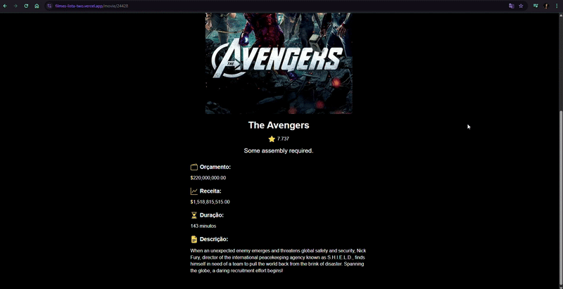

# 🎬 Movie App

Aplicação web feita em **React** que permite navegar entre filmes, visualizar detalhes e fazer buscas. A navegação é dinâmica e utiliza o React Router.

## 📸 Prints da Aplicação

<p float="left">
  
  
</p>
<p float="left">
  
</p>

## 🔗 Link para a Aplicação Online

- Acesse a aplicação aqui: [https://filmes-lista-two.vercel.app]  

# 🛠️ Tecnologias Utilizadas

- [React](https://reactjs.org/)
- [Vite](https://vitejs.dev/) ou Create React App
- [React Router](https://reactrouter.com/)
- CSS puro

# 📦 Instalação e Uso

## Pré-requisitos

- Node.js (versão 18.x ou superior)
- npm ou yarn

## Passos para rodar o projeto

### Bash
### 1. Clone o repositório
git clone https://github.com/seu-usuario/seu-repositorio.git

### 2. Acesse o diretório
cd seu-repositorio

### 3. Instale as dependências
npm install
### ou
yarn

### 4. Rode o projeto em modo de desenvolvimento
npm run dev
### ou
yarn dev

# 📁 Estrutura do Projeto

```bash
├── public/
│   ├── favicon.svg
│   └── logo.svg
├── src/
│   ├── components/
│   │   └── Navbar.jsx
│   ├── pages/
│   │   ├── Home.jsx
│   │   ├── Movie.jsx
│   │   └── Search.jsx
│   ├── App.jsx
│   ├── App.css
│   ├── index.css
│   └── main.jsx
