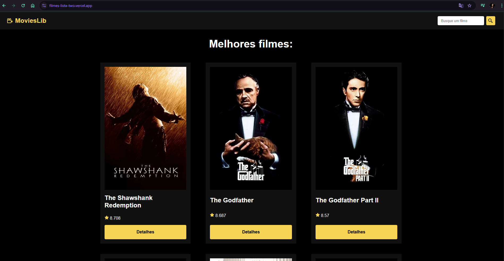

# 🎬 Movie App

Aplicação web feita em **React** que permite navegar entre filmes, visualizar detalhes e fazer buscas. A navegação é dinâmica e utiliza o React Router.

## 📸 Prints da Aplicação

  
  
  

## 🔗 Link para a Aplicação Online

Acesse a aplicação aqui: [https://filmes-lista-two.vercel.app/)  

---

# 🛠️ Tecnologias Utilizadas
-React
-React Router DOM
-Vite
-CSS puro

# 📁 Estrutura do Projeto
├── public/
│   ├── favicon.svg
│   └── logo.svg
├── src/
│   ├── components/
│   │   └── Navbar.jsx
│   ├── pages/
│   │   ├── Home.jsx
│   │   ├── Movie.jsx
│   │   └── Search.jsx
│   ├── App.jsx
│   ├── App.css
│   ├── index.css
│   └── main.jsx
